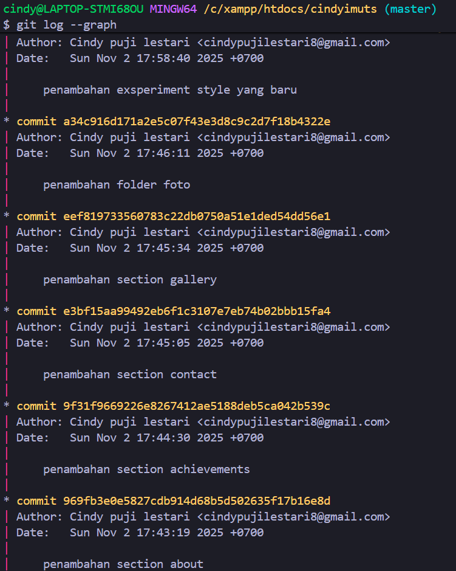
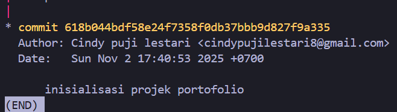
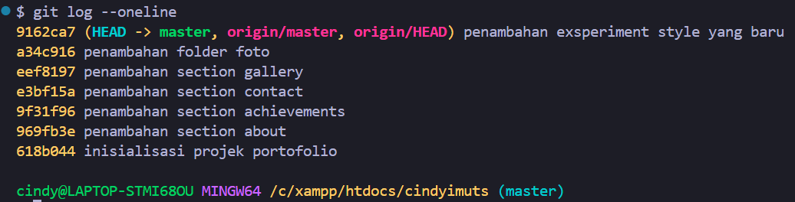
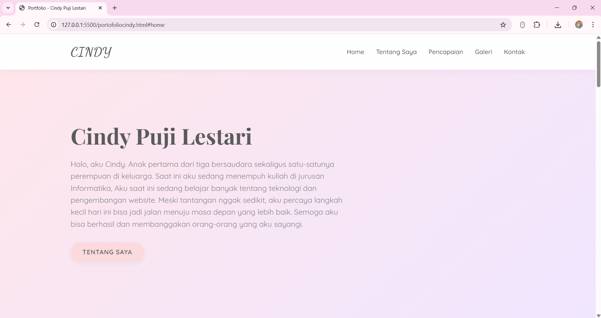
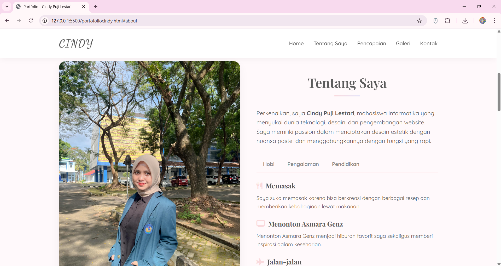
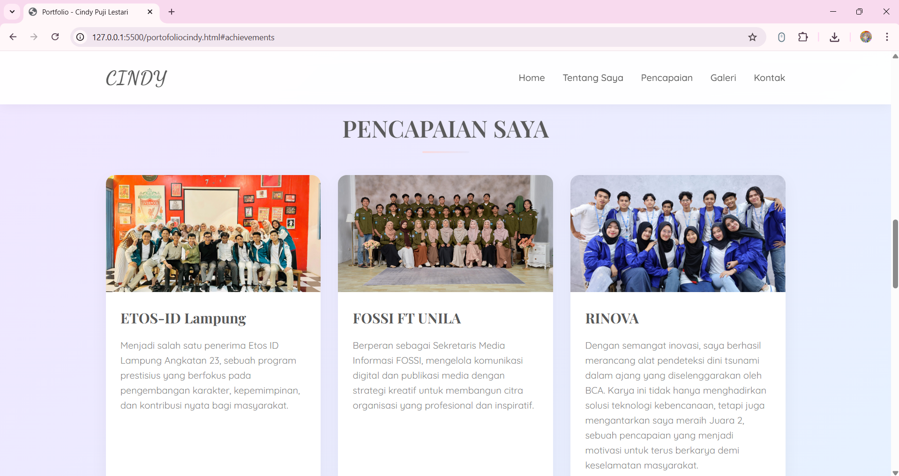
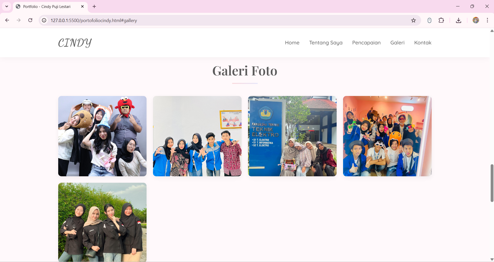
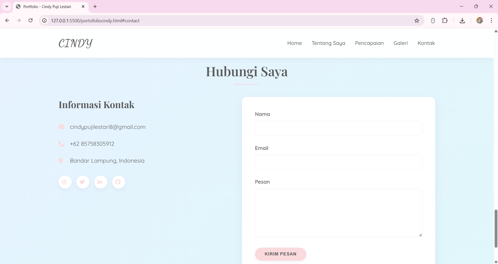

# Portfolio — Cindy Puji Lestari

Selamat datang di repositori Portfolio Cindy Puji Lestari. Ini adalah website portofolio statis yang menampilkan profil, pencapaian, galeri foto, dan informasi kontak.

Ringkasan singkat
- Nama proyek: Portfolio Cindy Puji Lestari
- Pemilik: Cindy Puji Lestari
- Tipe: Static Website (HTML, CSS)
- File utama: `index.html` (plus halaman pendukung di root)

Fitur utama
- Halaman Beranda (hero) dengan deskripsi singkat
- Halaman "Tentang Saya" dengan tab (CSS-only)
- Halaman Pencapaian dengan kartu proyek
- Galeri foto responsif
- Form kontak statis
- Desain responsif (mobile/tablet/desktop)

Teknologi
- HTML5
- CSS3 (variabel CSS, media queries)

Struktur proyek (ringkasan)

```
cindyimuts/                      # root project
├─ index.html
├─ about.html
├─ achievements.html
├─ gallery.html
├─ contact.html
├─ style.css
├─ README.md
└─ img/                          # folder gambar (foto, ikon, dsb)
    └─ docs/                     # tempat screenshot / dokumen 
```

## Screenshots

Dokumentasi Git:







Dokumentasi halaman (preview)
1. **Beranda**
   
2. **Tentang Saya**
   
3. **Pencapaian**
   
4. **Galeri**
   
5. **Kontak**
   

Cara menjalankan secara lokal
1. Langsung buka file: buka `index.html` dengan browser (klik dua kali).
2. Dengan server lokal (rekomendasi untuk path konsisten):

```powershell
# pindah ke folder proyek
cd C:\xampp\htdocs\cindyimuts
# jalankan Apache (XAMPP Control Panel)
# buka http://localhost/cindyimuts/index.html di browser
```

Cara publikasi (GitHub Pages)
1. Buat repository baru di GitHub.
2. Push branch yang ingin dipublikasikan (contoh perintah PowerShell):

```powershell
cd C:\xampp\htdocs\cindyimuts
git add .
git commit -m "Update: perbaikan layout, gambar, dan README"
git push origin master
# atau jika branch utama Anda bernama main:
# git push origin main
```

Butuh saya bantu push perubahan README & screenshot sekarang?
- Saya bisa commit dan push README (dan screenshot jika Anda tambahkan) untuk Anda. Kalau mau, beri tahu: saya akan commit + push ke branch `master`.

Kontak
- Email: cindypujilestari8@gmail.com

---
